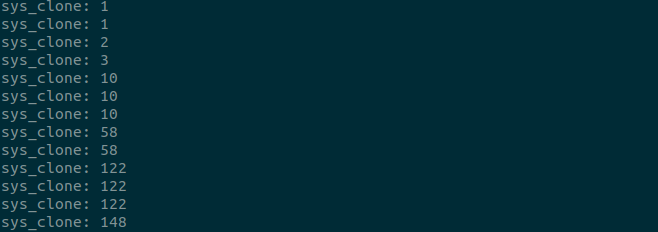

After watching a talk on [eBPF Superpowers][1], I wanted to give writing a program myself a try. Thanks to [BCC][2] BPF is pretty easy to get started using mostly python and a sprinkle of C.

We are going to start by writing a program that counts the number of times the kernel function `sys_clone` gets called, which is when a new process is created.

You can see a full list of kprobe commands on your system by taking a look at `cat /proc/kallsyms`, for our example it just matters that it is called.

The basic setup for a BPF program is to send the text of a C program to the BPF module to be compiled and run in our kernel. This is close to the minimum viable program:

```python
from bcc import BPF
from time import sleep

program = """
  int sys_clone_fn(void *ctx) { return 0 }
"""

b = BPF(text=program)
b.attach_kprobe(event="sys_clone", fn_name="sys_clone_fn")

while True:
  sleep(1)
```

The function name of our program has to match the fn_name argument to attach_kprobe. This function signature must return 0. When we call attach_kprobes, we will have our custom C function running in the background. The while True to block prevents our script from immediatly exiting. Out custom BPF function is running, but it does not do anything interesting yet.

To start counting things we introduce a BPF_HASH outside our function to increment our counter. This acts as a key/value hash map and takes the name of an instance as an init argument. `BPF_HASH(counts)` will create a hash map called counts

Within our function we will init a counter u64 value to increment, and use `counts.lookup(&key);` and `counts.update(&key, &value);` to get and set values. The updated program will look like this:

```
program = """
  BPF_HASH(counts);

  int sys_clone_fn(void *ctx) {
    u64 value = 0;
    u64 key = 56;

    u64 *p = counts.lookup(&key);
    if (p != 0) {
      value = *p;
    }
    value++;
    counts.update(&key, &value);

    return 0;
  }
"""
```

You may notice the value 56 being used as a somewhat random key. The key values for the hash must be an int, and here we borrow a numeric lookup value from a syscall program in bcc itself (https://github.com/iovisor/bcc/blob/master/src/python/bcc/syscall.py). If this were extended to track other system calls we could add them to the hash map as well.

To start printing values we look back to our while true loop and add a few changes:

```python
syscalls = {
  56: "sys_clone"
}

while True:
  sleep(1)
  for k, v in b["counts"].items():
    name = syscalls[k.value]
    print("{}: {}".format(name, v.value))
```

This sets up the number to value lookup table for converting 56 back to a string, as well as printing the values in our hash. The keys and values returned from our BPF program are objects whose underlying value is returned by `.value`.

Putting it all together we have a running counter

```python
# counter.py
from bcc import BPF
from time import sleep

program = """
  BPF_HASH(counts);

  int sys_clone_fn(void *ctx) {
    u64 value = 0;
    u64 key = 56;

    u64 *p = counts.lookup(&key);
    if (p != 0) {
      value = *p;
    }
    value++;
    counts.update(&key, &value);

    return 0;
  }
"""

syscalls = {
  56: "sys_clone"
}

b = BPF(text=program)
b.attach_kprobe(event="sys_clone", fn_name="sys_clone_fn")

while True:
  sleep(1)
  for k, v in b["counts"].items():
    name = syscalls[k.value]
    print("{}: {}".format(name, v.value))
```

Running this with `python counter.py` and you should see something like this:



[bpf_superpowers]: https://www.youtube.com/watch?v=bj3qdEDbCD4
[bcc]: https://github.com/iovisor/bcc
