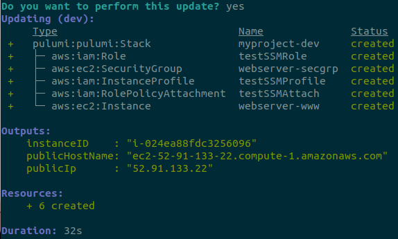

After watching [this talk from Luke Hoban][1], I wanted to give it a spin. Hoban's analogy of current tools as Assembly language of the could, that will eventually be surpassed by a programming language is pretty attractive. The steps there are huge, but any vision of helping get more done is exciting.

For our example will be spinning up an EC2 instance with SSM agent running, lettign us SSH in without an SSH key. Getting up and running was easy, will be using Typescript and AWS. In version 2.0 of Pulumi commands like `aws.getAmi` return a promise, wrapping it in `pulumi.output(...)` gets the value you are looking for. A lot of docs are pre-2.0, so it might be a gotcha when getting started.

Starting we need some imports and an AMI version:

```typescript
import * as aws from "@pulumi/aws";
import * as pulumi from "@pulumi/pulumi";

const ami = pulumi.output(aws.getAmi({
  filters: [{
    name: "name",
    values: ["amzn2-ami-hvm-*-x86_64-ebs"],
  }],
  owners: ["amazon"],
  mostRecent: true,
}));
```

Next a security group, only allowing in 22 for ssh:

```typescript
const group = new aws.ec2.SecurityGroup("webserver-secgrp", {
  ingress: [{ protocol: "tcp", fromPort: 22, toPort: 22, cidrBlocks: ["0.0.0.0/0"] }],
  egress: [{ protocol: "-1", fromPort: 0, toPort: 0, cidrBlocks: ["0.0.0.0/0"] }],
});
```

Add a role and policy for our EC2. This is where we can start seeing the power, references are just though regular attributes on objects:

```typescript
const testSSMRole = new aws.iam.Role("testSSMRole", {
  assumeRolePolicy: `{
  "Version": "2012-10-17",
  "Statement": {
    "Effect": "Allow",
    "Principal": {"Service": "ec2.amazonaws.com"},
    "Action": "sts:AssumeRole"
  }
}
`});

new aws.iam.RolePolicyAttachment("testSSMAttach", {
  policyArn: "arn:aws:iam::aws:policy/AmazonSSMManagedInstanceCore",
  role: testSSMRole.name,
});

const testSSMProfile = new aws.iam.InstanceProfile("testSSMProfile", {
  name: "testSSMProfile",
  role: testSSMRole,
})
```

With our Profile, AMI, and security group we attach them all to an EC2 instance. This instance needs a userData script to bootstrap SSM:

```typescript
const server = new aws.ec2.Instance("webserver-www", {
  instanceType: size,
  securityGroups: [group.name],
  ami: ami.id,
  iamInstanceProfile: testSSMProfile,
  userData: `#!/bin/bash
set -ex

cd /tmp
sudo yum install -y https://s3.amazonaws.com/ec2-downloads-windows/SSMAgent/latest/linux_amd64/amazon-ssm-agent.rpm
sudo systemctl enable amazon-ssm-agent
sudo systemctl start amazon-ssm-agent
`});
```

And the last bit, output a few attributes for us to connect with:
```typescript
export const publicIp = server.publicIp;
export const publicHostName = server.publicDns;
export const instanceID = server.id;
```

Running `pulumi up` and we have output about our EC2 after a few seconds.




Next, using SSM to connect ([check here to set up the CLI][2]), we just run `aws ssm start-session --target <instanceID>` and we are in!

What is exciting here is the whole script feels like familiar Typescript. As much as I like working with Terraform or CloudFormation, those unfamiliar are sometimes intimidated by the syntax. In the case of Pulumi, the syntax feels no more different than working with just another package.

This is the whole script:

```typescript
import * as aws from "@pulumi/aws";
import * as pulumi from "@pulumi/pulumi";

const testSSMRole = new aws.iam.Role("testSSMRole", {
  assumeRolePolicy: `{
  "Version": "2012-10-17",
  "Statement": {
    "Effect": "Allow",
    "Principal": {"Service": "ec2.amazonaws.com"},
    "Action": "sts:AssumeRole"
  }
}
`,
});

new aws.iam.RolePolicyAttachment("testSSMAttach", {
  policyArn: "arn:aws:iam::aws:policy/AmazonSSMManagedInstanceCore",
  role: testSSMRole.name,
});

const testSSMProfile = new aws.iam.InstanceProfile("testSSMProfile", {
  name: "testSSMProfile",
  role: testSSMRole,
})

const size = "t2.micro";
const ami = pulumi.output(aws.getAmi({
  filters: [{
    name: "name",
    values: ["amzn2-ami-hvm-*-x86_64-ebs"],
  }],
  owners: ["amazon"],
  mostRecent: true,
}));

const group = new aws.ec2.SecurityGroup("webserver-secgrp", {
  ingress: [{ protocol: "tcp", fromPort: 22, toPort: 22, cidrBlocks: ["0.0.0.0/0"] }],
  egress: [{ protocol: "-1", fromPort: 0, toPort: 0, cidrBlocks: ["0.0.0.0/0"] }],
});

const server = new aws.ec2.Instance("webserver-www", {
  instanceType: size,
  securityGroups: [group.name],
  ami: ami.id,
  iamInstanceProfile: testSSMProfile,
  userData: `#!/bin/bash
set -ex

cd /tmp
sudo yum install -y https://s3.amazonaws.com/ec2-downloads-windows/SSMAgent/latest/linux_amd64/amazon-ssm-agent.rpm
sudo systemctl enable amazon-ssm-agent
sudo systemctl start amazon-ssm-agent
`,
});

export const publicIp = server.publicIp;
export const publicHostName = server.publicDns;
export const instanceID = server.id;
```

[1]: https://youtu.be/yIIMf8ohrsg?t=138
[2]: https://docs.aws.amazon.com/systems-manager/latest/userguide/session-manager-working-with-install-plugin.html
