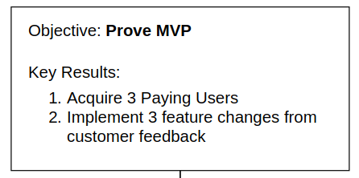
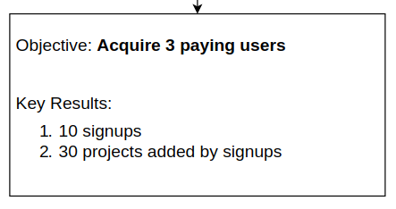
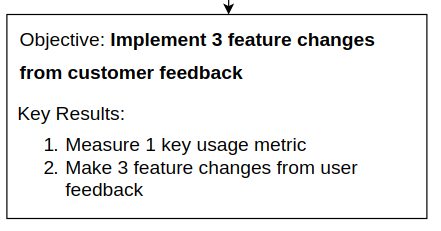
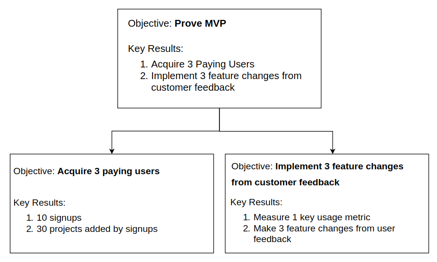

Let's start with some OKRs for this article

#### Objective: Explain a workable model for planning

| Key Result                                                                             | Score |
|----------------------------------------------------------------------------------------|-------|
| Walkthrough a complete example of ORKs                                                 |       |
| Connect multiple levels of OKRs                                                        |       |
| Provide an easy way for the reader to give feedback on an Objective or Key Result here |       |
|                                                                                        |       |

OKRs are an easy tool to help focus and prioritize when there is more work than time to do that work. If you are like me, it might feel like there are two new ideas for every one idea that you start working on. This quickly leads to a never-ending to-do list of good ideas. While all ideas might be good ideas, they move different needles in different directions and the decision time for deciding which one to work on gets longer as the list gets bigger. What helps is an easy way to make decisions quickly.

The outcome of OKRs is a lightweight decision-making framework. A frequent misconception is that OKRs only fit for big corporations, not the type of process overhead our small and nimble group would need. If you are going to be nimble you need a lightweight decision-making process. The absence of a lightweight process is either guessing or a heavyweight process (heavyweight does not just mean paperwork, it can also includes back and forths from ambiguity, working on the wrong thing from miscommunication, forgotten decisions).

Before getting into OKRs, let's identify a few questions we want to be able to answer from our tool:
transparency, are we still doing what we planned?
alignment, is everything pointed in the same direction?
prioritization, where can we make tradeoffs?

Answering these questions is often very time-consuming, and if it is easy we can avoid the trap of feeling like we have to get two things done at once.

## OKRs

For any good goal-setting process it is important to make everything time-bound (see [SMART criteria][1]), frequent cadences for setting and evaluating OKRs are one or three months.

Our framework is made of up two primary components:
Objectives are your aspirational goals. Objectives should be time-bound, qualitative, and actionable by the person or team
Key Results measure if you are achieving the Objective. Key Results should be quantifiable, achievable, have objective grading

An Objective should have a few Key Results, the summation of the key results should ideally be what rolls up into completing the Objective. A company/team/person can have a few Objectives, there is no hard and fast rule on totals but I find if the summation of Key Results exceeds 7 then prioritization gets much harder. This process happens at multiple levels, so for example the CEO would have one set of OKRs and the CPO another.

Since OKRs happen at multiple levels, how can we link them together? The Key Results of a higher level become the Objectives of a lower level. This gives us an easy to visualize representation of our goal hierarchy. The top of the tree is the top objective for the company, and the leaves of the tree are Key Results that ultimately roll up into the top Objective.

## Example

So what does an example look like for an MVP? Well, we need to start with the highest level objective, in our case: prove the MVP satisfies customer's needs. This is actionable and aspirational. To achieve this we have two key results: 3 paying customers and 3 feature changes from customer feedback. These are achievable, quantifiable, and roll up into the objective.

objective: 3 paying customers
20 calls with prospects
  - 10 signups
   - 30 projects added by signups

On the left side of the tree, the Key Result becomes the objective of the level below. Proving the MVP is no longer achievable directly at this level, but acquiring 3 paying users is. This then has three Key Results that roll up into completing the objective.

objective: 3 paying customers
20 calls with prospects
    - 10 signups
   - 30 projects added by signups

And on the right side, again Prove the MVP is also not directly achievable at this level but "3 feature changes from customer feedback" is achievable. It has three Key Results that roll-up.

objective: 3 feature changes from customer feedback
10 product feedback to feature change decisions
   - dogfood 3 current projects added
   - 5 tests completed for the production smoke test suite

Now putting this together we have a full tree of goals focusing on the most important activities for the company. For each level, the Objective and Key Results are directly actionable by the person/team at that level. Comparing this to our original targets:
Transparent: our single tree lets us see everything in one view
Alignment: the top Objective is at the top, it is clear how all the leaves should be rolling up into the top
Prioritization: give the rollup, it is easy to have discussions about what could be changed as new information comes in

prove MVP
 - 3 paying customers
   - 20 calls with prospects
   - 10 signups
   - 30 projects added by signups
 - 3 feature changes from customer feedback
   - 10 product feedback to feature change decisions
   - dogfood 3 current projects added
   - 5 tests completed for the production smoke test suite

## Wrapup

Looking back at the original OKRs for this article, we can see how we did.

| Key Result                                                                             | Score                                                                                                                        |
|----------------------------------------------------------------------------------------|------------------------------------------------------------------------------------------------------------------------------|
| Walkthrough a complete example of ORKs                                                 | done, in the example above                                                                                                   |
| Connect multiple levels of OKRs                                                        | done, in the example above                                                                                                   |
| Provide an easy way for the reader to give feedback on an Objective or Key Result here | done, between the context of the OKRs for this MVP and the comment section below - do you see anything that can be improved? |
|                                                                                        |                                                                                                                              |    |       |

In summation of those Key Results, we can say our objective was completed: 'Explain a workable model for planning'.

Hope this helps! If you have an hour I recommend [a talk from Rick Klau at Google][2], who does a great job explaining the process

[1]: https://en.wikipedia.org/wiki/SMART_criteria
[2]: https://www.youtube.com/watch?v=mJB83EZtAjc
