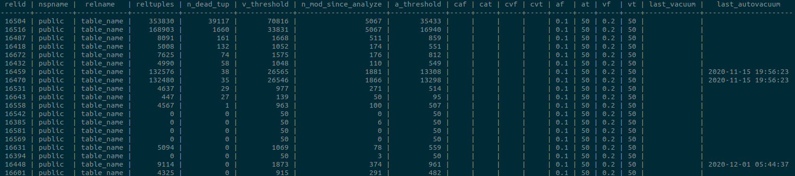

You need to tune Postgres auto-vacuum settings, but per-table can be hard to manage.

Postgres auto-vacuum and auto-analyze settings are important for managing Postgres performance. The first improvement you will probably make is adjusting the default, and conservative global values. These values will generally work for smaller data sizes but will start causing pain in larger data sets. The trigger kicks in using `(scale_factor * rows) + threshold`, so for large tables a default scale_factor of `0.20` will trigger far less often than you may like.

### Default global auto-vacuum settings
```
autovacuum_analyze_scale_factor = .10
autovacuum_analyze_threshold = 50
autovacuum_vacuum_scale_factor = .20
autovacuum_vacuum_threshold = 50
```

After changing global settings, you will likely have tables with significantly different characteristics than others. This leads us into per-table tuning, which can be pretty easily

### Alter table-specific autovacuum settings
```sql
ALTER TABLE foo SET (autovacuum_vacuum_scale_factor = 0, autovacuum_vacuum_threshold = 100)
```

While making the changes on one table might be a good start, it is easy to start losing track of which tables have what settings. For myself, it is nice to have a quick view of what the current settings are.

This is a query that gives all the high-level information to understand the status of your per-table auto-vacuum settings:



| column | notes
| -- | --
| nspname | the namespace of the table
| relname | the table name
| reltuples | total number of tuples
| n\_dead\_tup | number of dead tuples needing to be vacuumed
| v_threshold | autovacuum threshold for dead tuples
| n\_mod\_since_analyze | number of tuples modified since last analyze
| a_threshold | autoanalyze threshold for dead tuples
| caf | custom autoanalyze factor
| cat | custom autoanalyze threshold
| cvt | custom autovacuum threshold
| cvf | custom autoanalyze factor
| af | global autoanalyze factor
| at | gloval autovacuum threshold
| vf | global autovacuum factor
| vt | global autovacuum threshold
| last_vacuum |
| last_autovacuum |

### View All table-specific auto-vacuum settings

```sql
WITH raw_data AS (
  SELECT
    pg_namespace.nspname,
    pg_class.relname,
    pg_class.oid AS relid,
    pg_class.reltuples,
    pg_stat_all_tables.n_dead_tup,
    pg_stat_all_tables.n_mod_since_analyze,
    (SELECT split_part(x, '=', 2) FROM unnest(pg_class.reloptions) q (x) WHERE x ~ '^autovacuum_analyze_scale_factor=' ) as c_analyze_factor,
    (SELECT split_part(x, '=', 2) FROM unnest(pg_class.reloptions) q (x) WHERE x ~ '^autovacuum_analyze_threshold=' ) as c_analyze_threshold,
    (SELECT split_part(x, '=', 2) FROM unnest(pg_class.reloptions) q (x) WHERE x ~ '^autovacuum_vacuum_scale_factor=' ) as c_vacuum_factor,
    (SELECT split_part(x, '=', 2) FROM unnest(pg_class.reloptions) q (x) WHERE x ~ '^autovacuum_vacuum_threshold=' ) as c_vacuum_threshold,
    to_char(pg_stat_all_tables.last_vacuum, 'YYYY-MM-DD HH24:MI:SS') as last_vacuum,
    to_char(pg_stat_all_tables.last_autovacuum, 'YYYY-MM-DD HH24:MI:SS') as last_autovacuum
  FROM
    pg_class
  JOIN pg_namespace ON pg_class.relnamespace = pg_namespace.oid
    LEFT OUTER JOIN pg_stat_all_tables ON pg_class.oid = pg_stat_all_tables.relid
  WHERE
    n_dead_tup IS NOT NULL
    AND nspname NOT IN ('information_schema', 'pg_catalog')
    AND nspname NOT LIKE 'pg_toast%'
    AND pg_class.relkind = 'r'
), data AS (
  SELECT
    *,
    COALESCE(raw_data.c_analyze_factor, current_setting('autovacuum_analyze_scale_factor'))::float8 AS analyze_factor,
    COALESCE(raw_data.c_analyze_threshold, current_setting('autovacuum_analyze_threshold'))::float8 AS analyze_threshold,
    COALESCE(raw_data.c_vacuum_factor, current_setting('autovacuum_vacuum_scale_factor'))::float8 AS vacuum_factor,
    COALESCE(raw_data.c_vacuum_threshold, current_setting('autovacuum_vacuum_threshold'))::float8 AS vacuum_threshold
  FROM raw_data
)
SELECT
  relid,
  nspname,
  relname,
  reltuples,
  n_dead_tup,
  ROUND(reltuples * vacuum_factor + vacuum_threshold) AS v_threshold,
  n_mod_since_analyze,
  ROUND(reltuples * analyze_factor + analyze_threshold) AS a_threshold,
  c_analyze_factor as caf,
  c_analyze_threshold as cat,
  c_vacuum_factor as cvf,
  c_vacuum_threshold as cvt,
  analyze_factor as af,
  analyze_threshold as at,
  vacuum_factor as vf,
  vacuum_threshold as vt,
  last_vacuum,
  last_autovacuum
FROM
  data
ORDER BY n_dead_tup DESC;
```

We pull a few columns from the [pg_class table][1], which is the catalog for anything that looks like a table. The `relkind` field narrows our search down to an 'ordinary table'. As well as filter out the information_schema, pg_catalog and anything that looks like a toast table with pg_toast.

The [pg_stat_all_tables records table statistics][2], which gives us the number of dead tuples in a table.

To get the namespace name we join the [pg_namespace table][3].

It is worth noting that `reloptions`, the field for custom table auto-vacuum settings, is a string array. While most often its vacuum and analyze settings that are configured on a per-table basis, you could modify this query to view any of the other vacuum tuning options like `autovacuum_vacuum_cost_limit` if those are being used.

[1]: https://www.postgresql.org/docs/12/catalog-pg-class.html
[2]: https://www.postgresql.org/docs/12/monitoring-stats.html
[3]: https://www.postgresql.org/docs/13/catalog-pg-namespace.html
