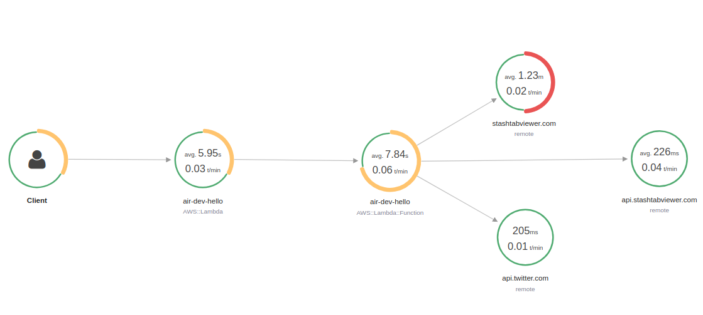
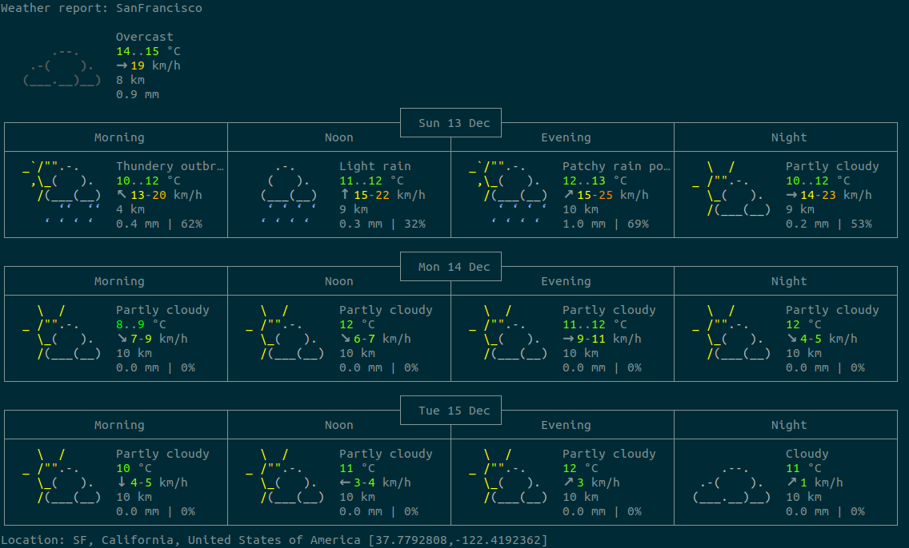

We need a quick way to set up a daily job that will be posting to Twitter. Today is the day we use [serverless.com][serverless_framework] and see how fast it is to get up and running.

There are a few steps:
1. Install
1. Setup xray tracing
1. Store credentials
1. Post to Twitter
1. Cron setup
1. Deploy and run



## Install

Either use `npm -g` or curl pipe to bash. I have been poking at how different curl-to-bash scripts work, so the second is both more fun and interesting to read.

```bash
npm install serverless -g
# or
curl -o- -L https://slss.io/install | bash
```

It is Typescript land, so install a few things:

```bash
serverless create --template aws-nodejs-typescript --path my_project

cd my_project
npm install axios aws-xray-sdk-core twit @types/twit
```

## Setup xray tracing

I am sure there must be a better way to do this, but [these lines seem to make the magic work][xray_magic].

```typescript
// handler.ts
const AWSXRay = require('aws-xray-sdk-core');
AWSXRay.captureHTTPsGlobal(require('http')); // Globally instrument http client
AWSXRay.captureHTTPsGlobal(require('https')); // Globally instrument https client
const http = require('http');
const https = require('https');
AWSXRay.capturePromise();
AWSXRay.setContextMissingStrategy(() => { });
```

## Store credentials

Serverless provides some [helpers for storing environment variables][serverless_secrets]. For speed, we are going to use a comma-separated StringList in SSM. We can fetch them out and populate our Twitter handle like this:

```typescript
var twitterCredentials = process.env.TWITTER_CREDENTIALS;
  const credsArr = twitterCredentials.split(",", -1)

  var T = new Twit({
    consumer_key: credsArr[0],
    consumer_secret: credsArr[1],
    access_token: credsArr[2],
    access_token_secret: credsArr[3],
  })
```

## Post to Twitter
Our setup involves getting some data with axios, then posting a hello to Twitter.

This is our main function:
```typescript
export const hello: APIGatewayProxyHandler = async (event, _context) => {
  const hello = await getHello()
  await tweetHello(hello)

  return {
    statusCode: 200,
    body: JSON.stringify({message: "success!", input: event}, null, 2),
  };
}
```

And these are our helper functions:
```typescript
const tweetHello = async (hello: any): Promise<any> => {
  var twitterCredentials = process.env.TWITTER_CREDENTIALS;
  const credsArr = twitterCredentials.split(",", -1)

  var T = new Twit({
    consumer_key: credsArr[0],
    consumer_secret: credsArr[1],
    access_token: credsArr[2],
    access_token_secret: credsArr[3],
  })

  const data = await T.post('statuses/update', { status: hello })
    .then((resp: any) => {
      return resp.data
    })

  return data
}

const getFeaturedStash = async () => {
  const instance = axios.create({
    httpAgent: new http.Agent(),
    httpsAgent: new https.Agent(),
    baseURL: 'wttr.in/SanFrancesco?format=3',
  });

  let featured = await instance.get()
    .then((resp: FeaturedStashResponse) => {
      return resp.data
    })

  return featured;
}
```

Our hello will be the current weather in San Francesco using the cli friendly weather api [wttr.in][wttr]

```bash
curl wttr.in/SanFrancesco?format=3
# SanFrancisco: ☁️ +15°C
```

The full output is really pretty, but too many characters for a tweet.



## Cron setup

For our cron setup we need to use the AWS cron syntax, then update the serverless function for cron, fetching the SSM secret, and enabling tracing.
This will run at 22:30 UTC every day.

```json
// serverless.ts
functions: {
  hello: {
    handler: 'handler.hello',
    runtime: 'nodejs12.x',
    tracing: "Active",
    environment: {
      TWITTER_CREDENTIALS: '${ssm:/prod/twitter/api_credentials}'
    },
    events: [
      { schedule: 'cron(30 22 * * ? *)' }
    ]
  }
}
```

## Deploy and run

For deploying and testing use:
```bash
sls deploy && serverless invoke -f hello -l
```

Otherwise, just deploy and wait

```bash
sls deploy
```

[serverless_framework]: https://www.serverless.com
[serverless_secrets]: https://www.serverless.com/blog/aws-secrets-management
[aws_cron_syntax]: https://docs.aws.amazon.com/AmazonCloudWatch/latest/events/ScheduledEvents.html
[xray_magic]: https://stackoverflow.com/a/59506029/4205905
[wttr]:https://github.com/chubin/wttr.in
