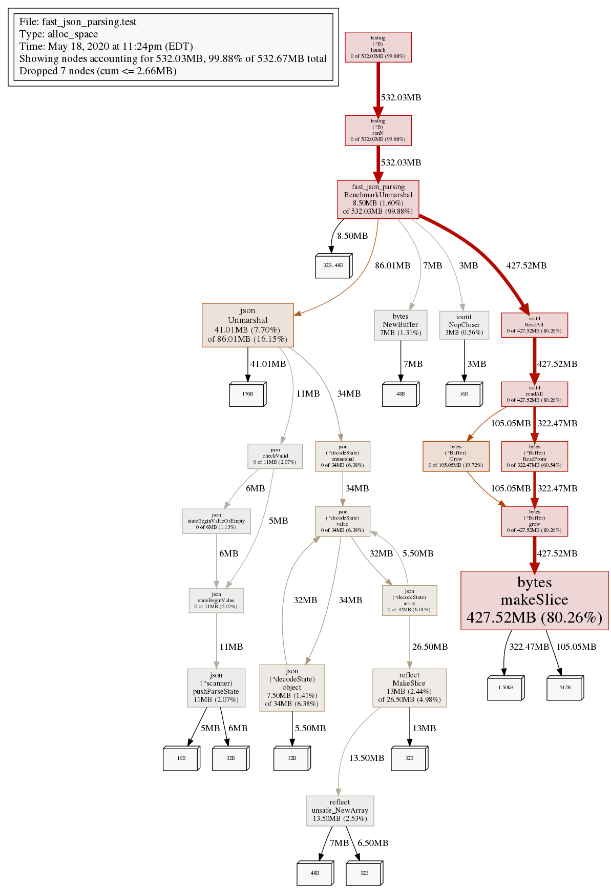

We will be speeding up our JSON processing by 11x with a few tricks:
 - reusing allocated memory
 - the Flyweight pattern
 - JSON parsing without reflection

As well as the profiling commands for you to run the same.


## The setup

Our example will focus on receiving a blob of json. Represening a box of items that must be turned into structs that will be used by our app.
```go
var data = []byte(`{"items":[
  {"id": 1},
  {"id": 2},
  {"id": 3},
  {"id": 4},
  {"id": 5}
]}`)


func TheSlowVersion() {
  bodyBytes, _ := ioutil.ReadAll(body)
  box := BoxType{}
  _ = json.Unmarshal(bodyBytes, &box)
}
```

Our concept of an app is a process that receives input, does some processing, then produces some output.


Let's say we are getting this data from an HTTP request body `req.Body`, an io.ReadCloser. For our examples we will simplify to a NopCloser, the same interface but fewer moving parts:
```go
body := ioutil.NopCloser(bytes.NewBuffer(data))
```

Now for our ingest and processing, we have a BoxType and ItemType to correspond to our JSON blob. Your first solution might be to use `ioutil.ReadAll` and `json.Unmarshal` to get out data into a struct:
```go
func must(err error) {
  if err != nil {
    panic(err)
  }
}

type BoxType struct {
  Items []ItemType `json:"items"`
}

type ItemType struct {
  ID int `json:"id"`
}

var data = []byte(`{"items":[
  {"id": 1},
  {"id": 2},
  {"id": 3},
  {"id": 4},
  {"id": 5}
]}`)

func TestUnmarshal(t *testing.T) {
  body := ioutil.NopCloser(bytes.NewBuffer(data))

  bodyBytes, err := ioutil.ReadAll(body)
  must(err)

  box := BoxType{}
  err = json.Unmarshal(bodyBytes, &box)
  must(err)

  if len(box.Items) != 5 {
    t.Fatalf("box wrong size %+v", box)
  }
}
```

Turning this test into a benchmark:

```go
func BenchmarkUnmarshal(b *testing.B) {
  for n := 0; n < b.N; n++ {
    body := ioutil.NopCloser(bytes.NewBuffer(data))

    bodyBytes, err := ioutil.ReadAll(body)
    must(err)

    box := BoxType{}
    err = json.Unmarshal(bodyBytes, &box)
    must(err)

    if len(box.Items) != 5 {
      panic("box wrong length")
    }
  }
}
```

Running the benchmark:

```shell
go test -cpuprofile cpu.prof -memprofile mem.prof -bench=BenchmarkUnmarshal ./...
# BenchmarkUnmarshal-12       297004        6383 ns/op
```
Not bad, 6383 ns/op, we can use this as our point of reference. For a lot of applications this is fast enough, but let's see what else we can do to speed it up. Rendering the profile with pprof `go tool pprof -png mem.prof > mem.png`, we are losing cycles to allocating memory in ReadAll.



Let's try re-using a buffer between requests:

```go
func BenchmarkCopy(b *testing.B) {
  block := make([]byte, 10000)

  for n := 0; n < b.N; n++ {
    body := ioutil.NopCloser(bytes.NewBuffer(data))

    buf := bytes.NewBuffer(block)
    buf.Reset()
    out := io.Writer(buf)

    _, err := io.Copy(out, body)
    must(err)
    block = buf.Bytes()

    box := BoxType{}
    err = json.Unmarshal(block, &box)
    must(err)

    if len(box.Items) != 5 {
      panic("box wrong length")
    }
  }
}
```

Running the benchmark:

```shell
go test -cpuprofile cpu.prof -memprofile mem.prof -bench=BenchmarkCopy ./...
# BenchmarkCopy-12        469872        2640 ns/op
```

Starting to look better, 2.4x faster! Following a similar approach, we can use the Flyweight pattern to reuse the objects we are unmarshalling to. We need to add a few methods to zero out our box and items:

```go
type BoxType struct {
  Items []ItemType `json:"items"`
}

type ItemType struct {
  ID int `json:"id"`
}

func (b *BoxType) Reset() {
  for i := range b.Items {
    b.Items[i].Reset()
  }
  b.Items = b.Items[:0]
}

func (i *ItemType) Reset() {
  i.ID = 0
}
```

Which we call before releasing them back for reuse:

```go
func BenchmarkFlyweight(b *testing.B) {
  block := make([]byte, 10000)
  box := BoxType{}

  for n := 0; n < b.N; n++ {
    body := ioutil.NopCloser(bytes.NewBuffer(data))

    buf := bytes.NewBuffer(block)
    buf.Reset()
    out := io.Writer(buf)

    _, err := io.Copy(out, body)
    must(err)
    block = buf.Bytes()

    err = json.Unmarshal(block, &box)
    must(err)

    if len(box.Items) != 5 {
      panic("box wrong length")
    }
    box.Reset()
  }
}
```
```shell
go test -cpuprofile cpu.prof -memprofile mem.prof -bench=BenchmarkFlyweight ./...
# BenchmarkFlyweight-12       497426        2258 ns/op
```

More improvements, 2.8x from when we started. Since our objects only have a single ID field the impact from this step will be smaller than if they were larger objects with more fields. Looking back at our pprof profile for CPU ` go tool pprof -png cpu.prof > cpu.png`


We are losing most of our cycles to unmarshalling the json. The default unmarhsaller uses a relatively slow reflection process. We can swap this out to a non-reflection based JSON parser [github.com/buger/jsonparser][1]. The syntax here is a little different. Instead of relying on JSON tags we specify our keys in a slightly different syntax:

```go
jsonparser.ArrayEach(block, func(value []byte, dataType jsonparser.ValueType, offset int, err error) {
  id, err := jsonparser.GetInt(value, "id")
  must(err)

  box.Items = append(box.Items, ItemType{ID: int(id)})
}, "items")
```

Putting it together:
```go
func BenchmarkJSONParse(b *testing.B) {
  block := make([]byte, 10000)
  box := BoxType{}

  for n := 0; n < b.N; n++ {
    body := ioutil.NopCloser(bytes.NewBuffer(data))

    buf := bytes.NewBuffer(block)
    buf.Reset()
    out := io.Writer(buf)

    _, err := io.Copy(out, body)
    must(err)
    block = buf.Bytes()

    jsonparser.ArrayEach(block, func(value []byte, dataType jsonparser.ValueType, offset int, err error) {
      id, err := jsonparser.GetInt(value, "id")
      must(err)

      box.Items = append(box.Items, ItemType{ID: int(id)})
    }, "items")

    box.Reset()
  }
}
```

Running the benchmark:

```shell
go test -cpuprofile cpu.prof -memprofile mem.prof -bench=BenchmarkJSONParse ./...
# BenchmarkJSONParse-12      1990920         577 ns/op
```

Rerunning our benchmark we are down to 577 ns/op, 11x faster! If we take a closer look at a pprof profile `go tool pprof -pdf mem.prof > mem.png`, after our NopCloser buffer we are making 0 allocations when we ingest the data.


It is interesting to see how much performance there might be sitting on the table.

Final note, it is worth mentioning that there are a few concurrency layers that likely exist in a real use case that we can skip in local benchmark examples, e.g. don't share a global byte slice between requests! And also measure before experimenting with performance improvements.

[1]: https://github.com/buger/jsonparser
[2]: https://en.wikipedia.org/wiki/Flyweight_pattern
