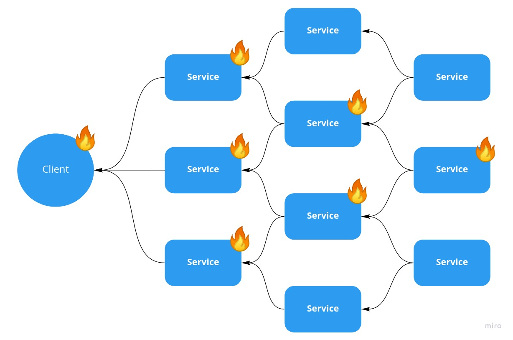

Its 2 AM alarms are going off that your microservice system, designed to be resilient to failure is now failing. After looking at your system metrics you discover that 100% of client requests are failing and 2/3 of your fleet of microservices, including all replicas, have taken themselves offline and refuse to start.

This type of issue traces back to a seemingly innocuous decision around health checks. Do you want to design for graceful failure or cascading failure?

Two popular health check endpoint I have seen are:
1. Return a static 200 status code, verifying the API is lively and able to respond promptly. This could include non-service dependencies like databases it owns.
1. Check all downstream service dependencies, only return 200 if all of those services are OK as well.

The downside to the static response is you can accidentally put a misconfigured service into the rotation. If the latest version introduces some error that prevents a service from connecting to its dependency, the static response would happily return 200 status code. A blue-green deploy would see a 200 and happily put the broken service into the rotation. Checking dependencies in a health check seems to resolve this issue, are there any downsides?

Making this type of change now impacts our runtime failure modes. We have just moved from a graceful failure mode to cascading failure mode at runtime.

With a static 200 health check, if a service goes down then none of the upstream health checks fail. When alarms go off, the issue we see is gracefully isolated to just the service that went down.

With a health check that depends on downstream dependencies, a failure cascades. When a downstream service goes down, everything upstream of it will see a dependency failing and then start failing itself. This cascades up to the client. In the illustration, we had a single downstream service go down, bringing down two that depended on it, and three more that depended on those. The result is all front-facing APIs are down, and to make matters worse for the recovery they can only be brought back online in a specific order.

### A better approach?

Kubernetes uses two different terms [liveliness and readiness][k8], to separate out startup vs runtime health concerns. While we can implement the same thing without two separate health check types, I like the separate terms they use.

#### At startup, readiness
Our dependency check is something we care about at startup time. Failing to connect to dependencies will correctly prevent a misconfigured service from coming into the rotation.

#### At runtime, liveliness
If we have already verified we were able to connect to our dependencies, checking them will lead to cascading failure. Now we want to check that the service is alive and able to respond, a static 200 response code.

We can implement the Kubernetes readiness and liveliness checks this without two check types, effectively the opposite of a [circuit breaker][breaker]. Until a service becomes ready, the health check looks at the dependencies of the service. After becoming ready, we flip a switch and now only ever return a static 200 response code.

[k8]: https://cloud.google.com/blog/products/containers-kubernetes/kubernetes-best-practices-setting-up-health-checks-with-readiness-and-liveness-probes
[breaker]: https://en.wikipedia.org/wiki/Circuit_breaker_design_pattern
