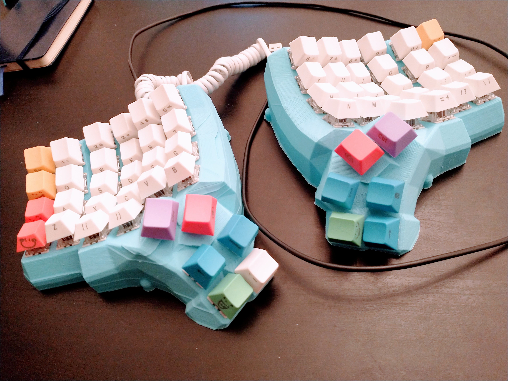
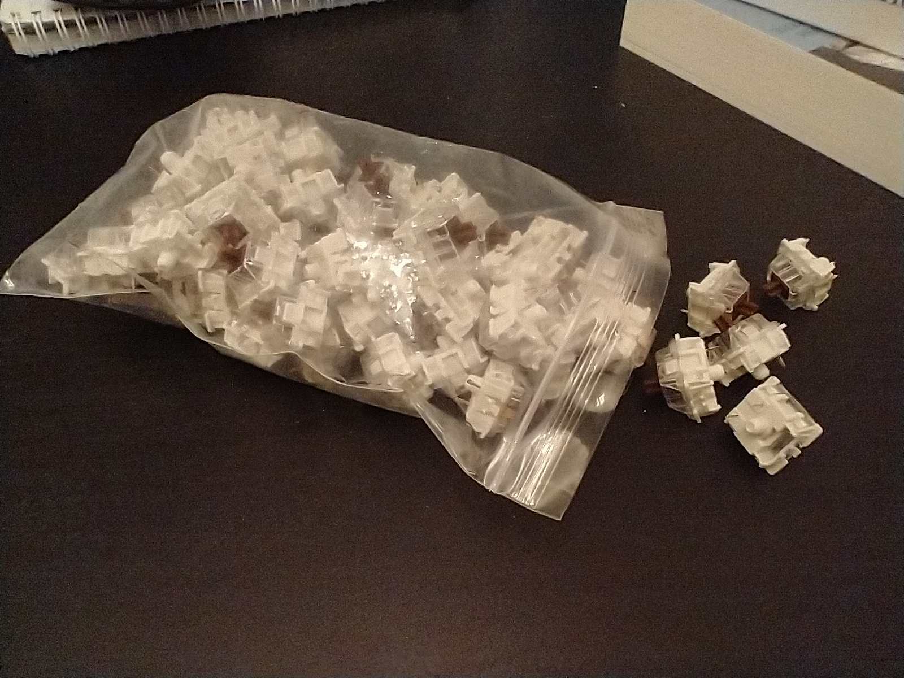
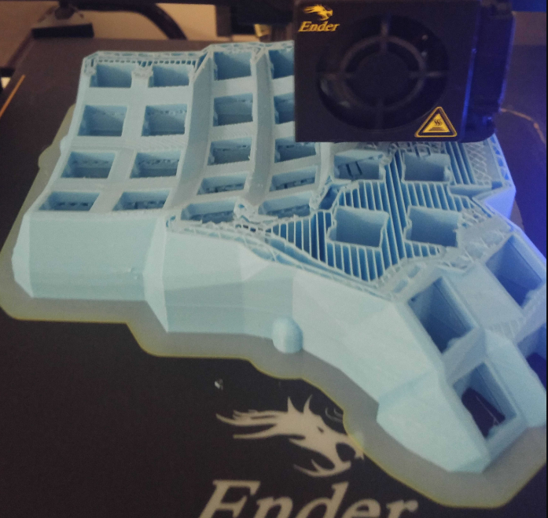
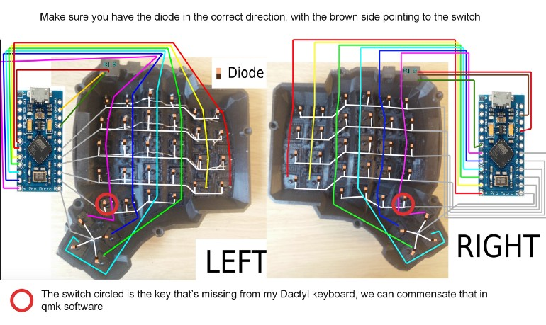
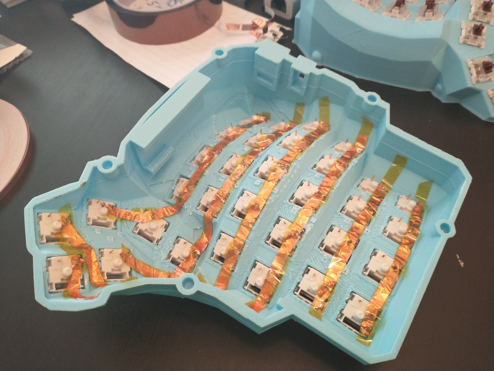
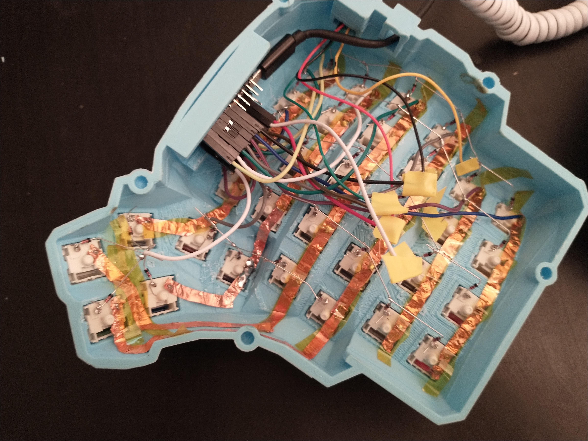
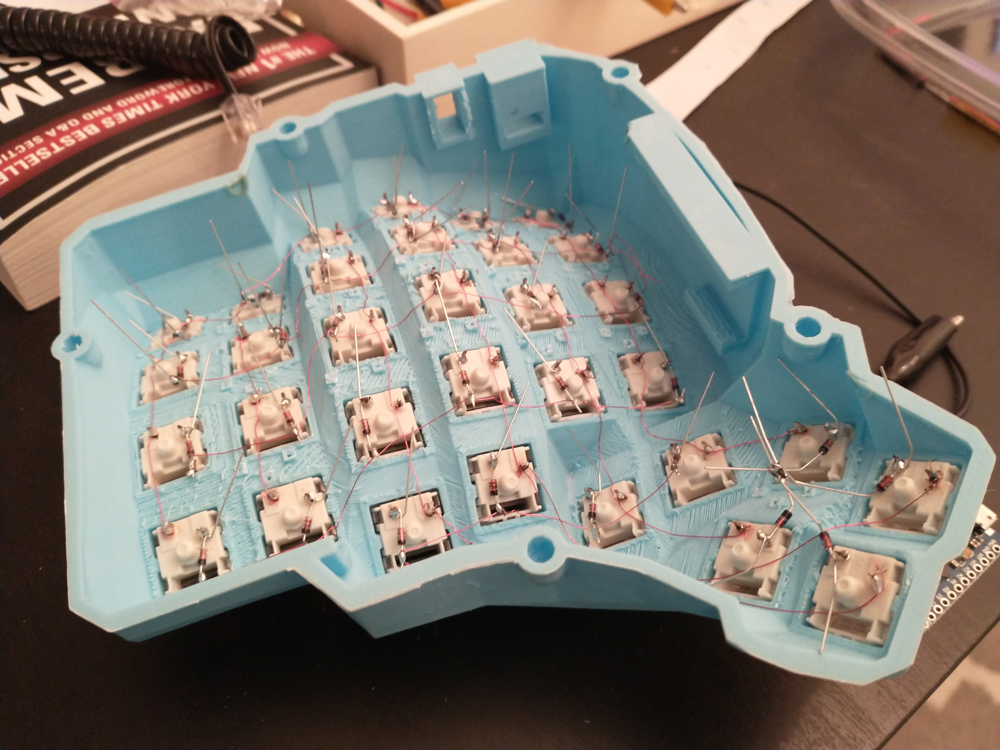
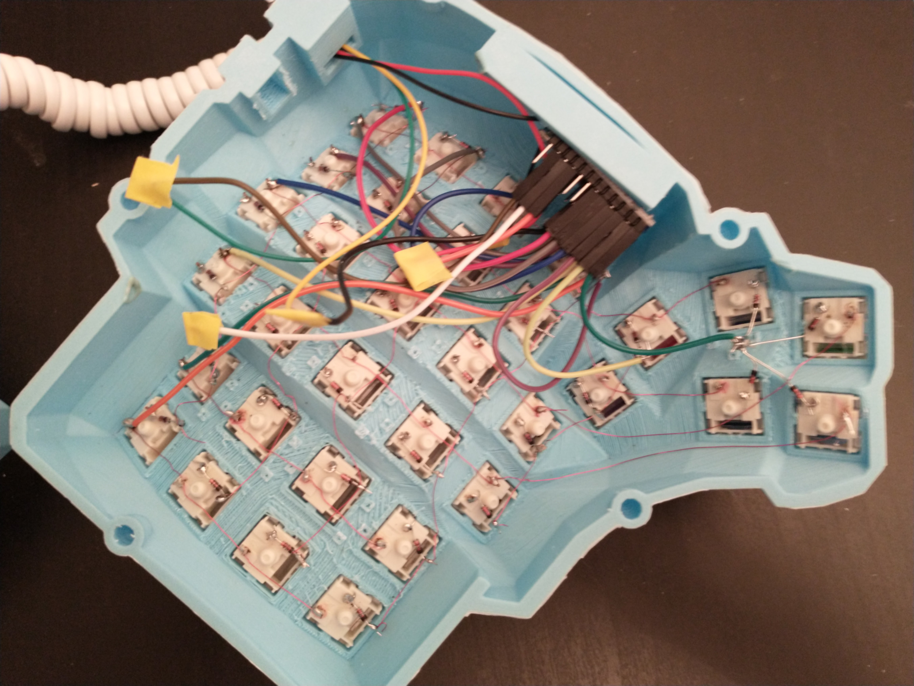

Originally I was looking at buying one from [OhMyKeycaps][ohmykeycaps] but after spending some time in Reddit [ErgoMechBoards][reddit_ergo] I decided this would be a fun project to complete, and something I would want to customize. The whole process was much easier than I expected, with designs that were available online and materials that were easy to get.




The steps:
1. Getting Materials
1. Print the case
1. Wiring and soldering
1. Flash the microcontroller


## 1) Getting Materials

| item | notes |
| --- | --- |
| 3D designs                            | 5x6 build you need a 3d printer, I used an Ender3Pro |
| PLA fillament                         | |
| 64 Gateron brown mechanical switches  | AliExpress 68 pack on sale, choose the type you like |
| keycaps                               | SeMi Profile, choose what you like |
| 32 awg enameled copper wire           | awg is up to you, insulated with rubber works as well |
| copper tape                           | optional |
| Kapton tape                           | optional |
| Electrical tape                         | very important some wires do not connect |
| 100 diodes                            | only 64 needed |
| 2 Arduino micro pros                  | AliExpress $4 each |
| 2 RJ9 connectors                      | Eash has 4 pins but just use 3 |
| telephone cord                        | For the RJ9 connectors |
| USB cable                             | To plug the Arduino into your computer |
| breadboard wires female-female        | |
| screws                                | M3 flat head male |
| screw holders                         | M3 threaded female |
| soldering kit                         | Iron, solder, tweezers |
| multimeter                            | I did not use one but it would have helped |


The most time I spent deciding on something was the switches, in this case settling on Gateron brown but there are [lots of options][switch_type], so long as they have the MX head to fit the keycaps. I originally made the mistake of purchasing 'mechanical optical' switches at half the price of mechanical ones. Turns out 'mechanical optical' are 'optical' instead of 'mechanical' which is a different and incompatible design. The key difference is you will need metal pins on the bottom of the switch to solder to.



## 2) Printing

With an Ender and Cura for slicing, the 3d printing took 16 hours per side. Designs are on [Thingiverse here][3d_designs]. For the printing settings part, I was playing with reducing the infill. Most of the printing material goes towards the supports which you needs to tear off when the print is done. There are a few [conversations online for different settings][printing_settings] that work better.



## 3) Wiring and soldering

With the help of wiring diagrams from [abstracthat's GitHub repo][abstracthat], [Complete idiot guide for building a dactyl manuform keyboard][dactyl_guide], and [building-my-first-keyboard-and-you-can-too][building-my-first-keyboard-and-you-can-too] the layout looks more intimidating than it was. We are wiring up 6 rows and 6 columns on each side, it is worth reading about [how the keystrokes are picked up][key_matrix] if you aren't familiar.



There was a small gotcha I bumped into using RJ9 jacks. The pins have to be symmetrically wired on each microcontroller, so each of the pins need to be wired into their counterpart on the other controller: GRD <-> GRD, VCC <-> VCC, and DATA <-> DATA. These can use any of the 3 pins in a 4 pin RJ9.

What got me was the wire colors on my RJ9 jacks were not symmetric. The yellow/black and green/red wires input to one RJ9 matched up to the other color on the output of the other RJ9. Checking the current helped me and involved a little extra soldering to debug the problem. The recommended approach is to use a multimeter, but I just used a little red LED.

I started out using copper tape covered with Kapton tape which I got the idea from [this video][wiring_1]. After finishing the first half I found the Kapton tape was getting in the way.



To keep the wire and tape away from touching the diodes, I ended up soldering the diodes raised about 1/3 of an inch above the copper tape, with each diode connecting to the next diode.


```
 ----\----\----\----\----\----\
      \    \    \    \    \    \
       D    D    D    D    D    D
       |    |    |    |    |    |
       S    S    S    S    S    S

D - diode
S - switch
```

The diodes have a direction, the black end must face away from the switch. If you get this backward and solder the black side closer to the switch then nothing will work.

To connect the rows and columns to the Arduino I used breadboard wires. I cut the female-female wires in half, connecting the female side to the Arduino and soldering the open wire side to the switch/diode. Having the breadboard female connectors came in handy when I messed up the RJ9 wiring, I only had to reconnect the breadboard wire instead of re-soldering. If I was to do it again I would just solder the wires directly to the Arduino.

For each of the RJ9 to breadboard soldering joints, I covered them with a little electrical tape. Having these wires exposed and touching another wire would cause problems.



### Right hand

After fiddling with Kapton tape getting in the way, I went with enameled wire for the right hand. The trick was to wrap the wire around each pin on the switches so the wire does not get pulled off while you are moving around. The nice and difficult part with enameled wire is stripping the enamel. Touching the hot soldering iron to the wire strips the enamel so we get to save time wire stripping, but accidentally touching the iron in the wrong spot and stripping the wrong section of the wire would lead to some headaches and wire replacement.

Instead of soldering diodes to each other like in the left hand, each diode is soldered to an enameled wire.



The tiny 32 awg wire, the wiring on the right hand took up much less space.



Connecting them with the phone cord and flipping them over, nearly done! If this is your first time doing this keep in mind you probably have at least 1 soldering joint that does not work, I missed 5 joints on my first pass.


## 3) Flash the microcontroller

The easiest way to get this done is to use the [QMK Toolbox][qmk_toolbox] for windows. It is just a few clicks in a UI:
 - download and run the `qmk_toolbox_install.exe` file
 - open the QMK toolbox
 - select the `handwired/dactyl_manuform/5x6`
 - load the .hex file
 - disconnect the Arduinos
 - plug one Arduino to your computer
 - hit reset button twice on the Arduino
 - flash the Arduino
 - repeat for the other Arduino

Afterward plug your two halves together and the keyboard into your computer, and give it a test! I recommend a site like this to verify all the keys work, a few of mine needed a little extra soldering work.

Congrats you now have a working Dactyl!

[key_matrix]: https://beta.docs.qmk.fm/developing-qmk/for-a-deeper-understanding/how_a_matrix_works
[dactyl_video]: https://www.youtube.com/watch?v=uk3A41U0iO4
[3d_designs]: https://www.thingiverse.com/thing:2666676/files?fbclid=IwAR3dL8Tap8NsdWcA5ilGTzswn1ULV8lPSfX48h26djx8e2-lwZuWR2mg2i8
[reddit_ergo]: https://www.reddit.com/r/ErgoMechKeyboards
[ohmykeycaps]: https://ohkeycaps.com/products/built-to-order-dactyl-manuform-keyboard
[switch_type]: https://dygma.com/blogs/stories/the-ultimate-guide-to-mechanical-keyboard-switches-for-2019
[printing_settings]: https://github.com/adereth/dactyl-keyboard/issues/52
[qmk_toolbox]: https://github.com/qmk/qmk_toolbox/releases

[dactyl_guide]: https://medium.com/swlh/complete-idiot-guide-for-building-a-dactyl-manuform-keyboard-53454845b065
[abstracthat]: https://github.com/abstracthat/dactyl-manuform
[building-my-first-keyboard-and-you-can-too]: https://sachee.medium.com/building-my-first-keyboard-and-you-can-too-512c0f8a4c5f
[wiring_1]: https://www.youtube.com/watch?v=dWC_8BOArzc
