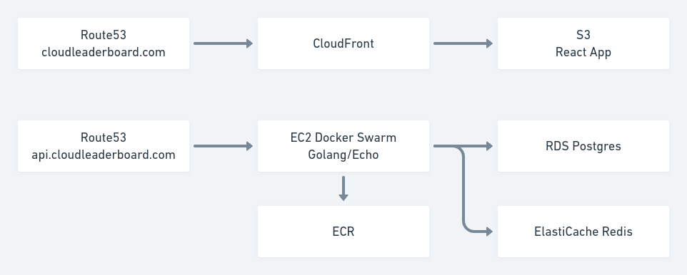
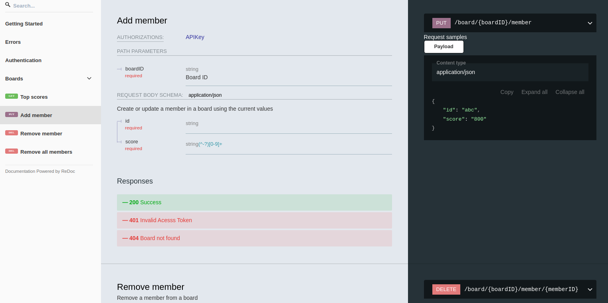
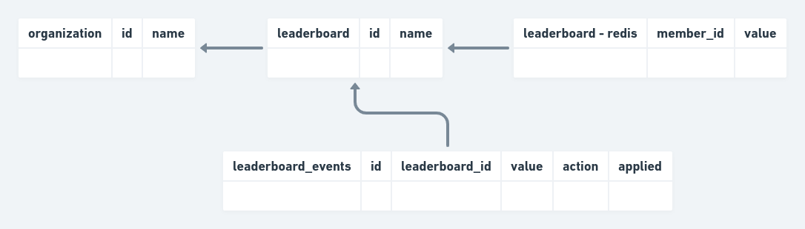

This is a write-up of a small SaaS app cloudleaderboard.com I had built, deployed, marketed, and since shut down.

In my professional career, I had seen first-hand how simple implementations of a leaderboard bottlenecked systems. It sometimes required a painful amount of engineering time to resolve what seemed like a simple problem and felt like the type of feature that some teams would want to outsource. Leaderboards struck me as the type of feature that a developer wants to "just work", similar to authentication I felt like it might be some margin where teams would outsource to SaaS even though they could build it themselves, like with Okta or Auth0.

## System design

Leaderboards show the ranked list of all users. The very top rank and the very bottom rank are easy to get with a SQL `ORDER BY` clause, the hard part is getting the rank around a user somewhere in the middle of a leaderboard. This is the primary use case I tried to build around.

### The leaderboard

**Postgres**

The simplest implementation for a leaderboard is to just stick with Postgres (or your SQL database) and use the `rank()` function.

```sql
-- create table users (id serial PRIMARY KEY, rating INTEGER NOT NULL);
-- insert into users (rating) select (random()*1000) from generate_series(1,10);

EXPLAIN WITH global_rank AS (
  SELECT id, rating, rank() OVER (ORDER BY rating DESC) FROM users
)
SELECT * FROM global_rank
WHERE rank <= (select rank from global_rank where id = 5)+3
AND   rank >= (select rank from global_rank where id = 5)-3;

-- QUERY PLAN
-- -----------------------------------------------------------------------------------
--  CTE Scan on global_rank  (cost=299.76..367.56 rows=11 width=16)
--    Filter: ((rank <= ($1 + 3)) AND (rank >= ($2 - 3)))
--    CTE global_rank
--      ->  WindowAgg  (cost=158.51..198.06 rows=2260 width=16)
--            ->  Sort  (cost=158.51..164.16 rows=2260 width=8)
--                  Sort Key: users.rating DESC
--                  ->  Seq Scan on users  (cost=0.00..32.60 rows=2260 width=8)
--    InitPlan 2 (returns $1)
--      ->  CTE Scan on global_rank global_rank_1  (cost=0.00..50.85 rows=11 width=8)
--            Filter: (id = 5)
--    InitPlan 3 (returns $2)
--      ->  CTE Scan on global_rank global_rank_2  (cost=0.00..50.85 rows=11 width=8)
--            Filter: (id = 5)
```

While the bright side is the simple implementation, just write a query with a database you already have. The downside is the `Seq Scan` required to complete this query, which will lead to a database bottleneck.

**Redis**

An improvement is to use in-memory sets with Redis. The hard part of the ordered list problem is to reorder everything on the fly, which Redis is quite fast at. In addition, there are a number of built-in commands for working with sorted sets like `ZRANK`. I had even written a blog post prior to this on [Building a Leaderboard with Redis](https://klotzandrew.com/blog/leaderboard-using-redis).

**Bigger and Better**

Since Redis is all in memory and memory is expensive, there are some limits to how large the sets can be before it's financially not worth it. [Strava engineering has a blog post on leaderboards](https://medium.com/strava-engineering/rebuilding-the-segment-leaderboards-infrastructure-part-1-background-13d8850c2e77), which involves adding Cassandra and Kafka into the mix on top of Redis. It is much more robust, but also more complicated.

Redis felt like the best choice to start with, for a tiny saas app I wouldn't have to worry about data size until there were customers and there would get a quick sub 1ms response time from Redis.

### Architecture

I picked a set of tools I happened to be using at the time. ECS would have been a better choice for container orchestration instead of Docker Swarm, but I happened to have had some scripts on hand around that made Docker Swarm faster to get running.

- Gitlab
- Stripe
- AWS
- EC2
- ECR
- Route53
- RDS Postgres
- ElastiCache
- Docker Swarm
- CloudFront
- S3



## Fun components

### OpenAPI Clients

Since the thing being sold was an API, I had wanted to do two things to build an awesome developer experience:

1. publish clients based on Swagger
2. have really awesome API docs, also based on Swagger

Publishing the clients to GitHub was something I ended up not having time for, but the e2e test suite was implemented with TypeScript clients generated from the Swagger definition directly, to the option was there to easily publish them with confidence that they were correctly tested.

The public value I did get from the OpenAPI spec was using Swagger to generate the API docs page, using [redoc](https://github.com/Redocly/redoc). Compared to the default Swagger UI, I felt like redoc looked more pleasant and modern however the downside is that is not interactive like Swagger UI.



### Distributed Consistency

Redis does not have strong consistency guarantees, so the plan was to build in fault-tolerance on top of it. When an update came in for a member, instead of directly updating Redis, we first save the request values in an events table, then publish them to Redis. Similar to an outbox.

The general design was to support this flow:

1. create an event with the payload params, and `applied = false` using an increasing sequence for each leaderboard
2. update Redis with the event parameters, with a single publisher per leaderboard
    1. using the last non-applied event for that leaderboard, if no lock has been acquired for publishing
    2. using a Redis transaction, update the last sequence number for that leaderboard (also stored in Redis)
    3. handle cases in sequence number mismatches between Redis and Postgres
3. update the Postgres event as `applied = true`



This covers a few cases of distributed failure that can either be checked per call or on a schedule:

- **Save to Redis fails** - using the sequence number per leaderboard if there is a mismatch between Postgres and Redis we have a fallback and replay point using the events
- **Save to Postgres Fails** **after Redis** - the same story as above, fallback and replay point using sequence ids
- **Data loss in Redis** - Postgres keeps events per leaderboard, so we can always replay events and rebuild
- **Data contention** - the monotonic sequence numbers and publishers only need to be unique within the scope of a single leaderboard

Additionally, if we need to migrate to another architecture we can replay the leaderboard events into the new system.

### MailHog

I had been looking to try out a tool for easily testing emails, and this was an opportunity to try out [MailHog](https://github.com/mailhog/MailHog). Incidentally, this is why I ended up bumping into [MailSlurp](https://www.mailslurp.com/), a SaaS tool for the same purpose. The main thing I wanted to test as a use case was invitation emails and password reset emails, where the email content has a token that can be used to unlock more behavior.

Architecturally the goal was to have an email client running locally, use that address when sending test emails, then call the API to fetch tokens out of the emails - and follow a single-use "invitation" to a team. MailHog made it easy to achieve this, it comes in a docker container and the API is relatively straightforward, it was overkill for a tiny project but emails were tested using it.

## Learnings

Getting users was hard, it is difficult to admit but when I shut the project down I had a grand total of 0 MMR. There were a number of interested parties looking for specific customized features: self-hosted, branded, prizes & rewards, sweepstakes & bonus periods. While these would have been possible to build, it was looking like it would have been a significantly different SaaS app than what I had in mind and closer to something like [https://gleam.io](https://gleam.io/). Moving in this direction was something I had thought about, but decided against it because the feature set and development time would have been significantly more than what felt like the 1 feature app I had built.

What I should have done from the beginning is taken a lesson from [Buffer's MVP](https://buffer.com/resources/idea-to-paying-customers-in-7-weeks-how-we-did-it/) and validated the concept before building anything.
