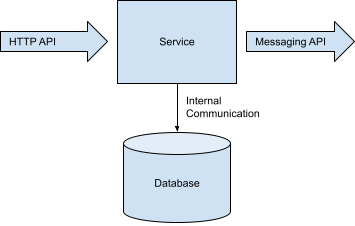

Will microservices sharing a database prevent them from being autonomous? If you are not sure, then the answer is most likely yes.

The autonomy of a microservice can be significantly limited by the autonomy the service has over its data. I frequently see autonomy measured as the ability to deploy independently. In the Docker world, this usually means a separate docker container. The problem with just looking at docker containers at deploy time is that it misses a really hard part of microservices, managing data at runtime.

For example, a microservice exposing a JSON HTTP endpoint, using a swagger API version is probably safe to deploy independently. A microservice exposing an endpoint that allows arbitrary class/method/argument invocations by the caller is much less likely to be deployed safely.

Two questions to consider for understanding data autonomy:
- What is the API surface to your service?
- How are those API contracts managed?

#### What is the API surface to your service?
If the data within our service is to be autonomous, we need to identify each way clients can read and write data. There terms [Fiefdoms and Emissaries][fiefdoms] comes to mind, where Fiefdoms are the castles with our guarded data and Emissaries travel the approved APIs to modify that data. The narrower the API surface the easier it will be to manage autonomy. HTTP endpoints are good candidates to be included in the API surface area, but internal classes or private methods are likely not.

#### How are those API contracts managed?
If a deploy breaks a contract, then deploys need to be coordinated with other services. Versioned schema management allows us to deploy independently, as long as the contract is still valid we are free to deploy and change our service internals.

Combining an API surface with a way to manage contracts enables our service to 'own' its data. This ownership is autonomy to deploy independently, communicating to clients though explicitly updating schema contracts.

### Examples (easy)

Does our service expose HTTP endpoints?
 - Writes are validated in application code on each endpoint
 - Reads depend on a versioned  schema

Does our service publish messages?
 - Publishing from our application use a versioned event schema
 - Consumers within our application use a versioned event schema

In both of these cases, we can imagine a JSON schema definition. A definition that can be used to generate a client.

### Examples (hard)

Does our service expose its database? Yes
 - Writes to the database require the same validation that application logic in the endpoints
 - Reads require a versioned schema

Databases are a huge surface area and SQL is much more expressive than JSON. This will likely cost that service its data autonomy, preventing it from being deployed independently. The impact of exposing internal tables is similar to exposing internal classes and private methods. All internals of the service become the business of other services.

Database sharing sometimes comes up with multiple services sharing the same database or a data pipeline connecting directly.

[fiefdoms]: https://slideplayer.com/slide/5370352/
