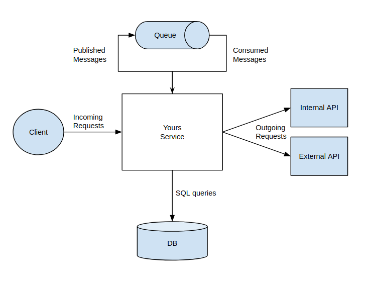

Effective monitoring for microservices requires an architecture that extends beyond the success rate of incoming HTTP requests. Coming from a web-centric point of view it is easy to think of these metrics only referring to inbound HTTP requests to our service. After all, the web is mostly HTTP requests, and serving might be the first thing our service does.

While inbound HTTP requests are a good start there are likely more communication channels your service uses besides incoming HTTP to communicate with the world. This diagram shows a few:
- HTTP outgoing requests to other services
- HTTP outgoing requests to 3rd party APIs
- SQL database calls
- AMQP messages published (outgoing)
- AMQP messages consumed (incoming)

The protocols and external services might vary, but the core idea is that any communication channel ingress or egress to your service can use the [RED metrics][red]. For each channel, figure out how to meaningfully group your data?
- HTTP method+path for HTTP traffic?
- event name for messages?
- the function name for SQL database calls?

With that grouping, we can use the RED acronym to establish consistent metrics for each communication channel.
- Rate - the number of requests your service is serving, per second
- Errors - the number of failed requests per second
- Duration - distributions of the amount of time each request takes

[red]: https://grafana.com/files/grafanacon_eu_2018/Tom_Wilkie_GrafanaCon_EU_2018.pdf
