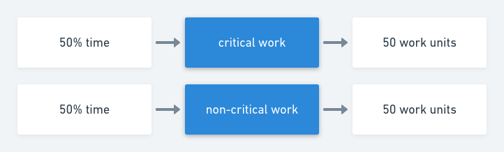
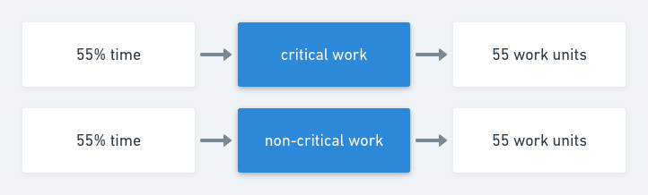
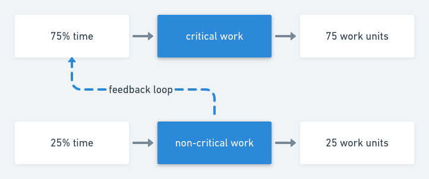

A pattern I have observed in projects falling behind is not a lack of output - but a lack of desired output. For example, a team is working on a critical project but the team is expected to deliver on 2-3 different activities eating 50% of the team's time. Overall the team's output could be high, but only 50% of that is being measured towards the critical project.

An insight for me from [Thinking in Systems][thinking_in_systems] was that adding an information feedback loop is a good place to start for significantly improving a system. Information changes how decisions get made and can be much easier to add compared to building something.

A linear solution to our out problem is to push the team to do work '10 harder'. This could mean more hours or adding a team member, effectively doing more with more. We would expect this type of change of 10% increased inputs to result in a 10% increase in desired output, or even less if adding more people reduces output with training and onboarding ([Brooks's Law][brooks_law]). Sometimes this is the best choice, but there might be a way to add a feedback loop and create a leverage point.

If we view a team as a system with two stocks of work. A stock of work contributing to the critical project, and a stock of work contributing to the non-critical project. In this system, our team is allocating 50% of their resources to each bucket and outputting 50 'work units' per bucket (an arbitrary unit of measure). Adding 10% more work would increase the inputs to each bucket from 50% to 55% of the original baseline, bringing us from 100 total work units to 110, from 50 to 55 in our critical project.

Instead, let's introduce an informational feedback loop. This information will surface the information of how much work is currently being done in the non-critical project category. Assuming we want to optimize for critical project work, we expect this to reduce the amount of work in the non-critical project. Team members have an easier forum to ask 'should we be working on something else instead?'

What happens if we start to see a more favorable balance between critical work and non-critical work? Let's say this changes our 50%/50% split to 75%/25% of critical vs non-critical work, reducing our non-critical work by half. This takes our critical work units from 50 to 75, representing a 50% improvement from our baseline, without adding more inputs to the system. Contrasted against our 10% extra output from 10% extra inputs, we were able to use a leverage point to increase output by 50% with 0% extra input.

[thinking_in_systems]: https://www.goodreads.com/book/show/3828902-thinking-in-systems
[brooks_law]: https://en.wikipedia.org/wiki/Brooks%27s_law
