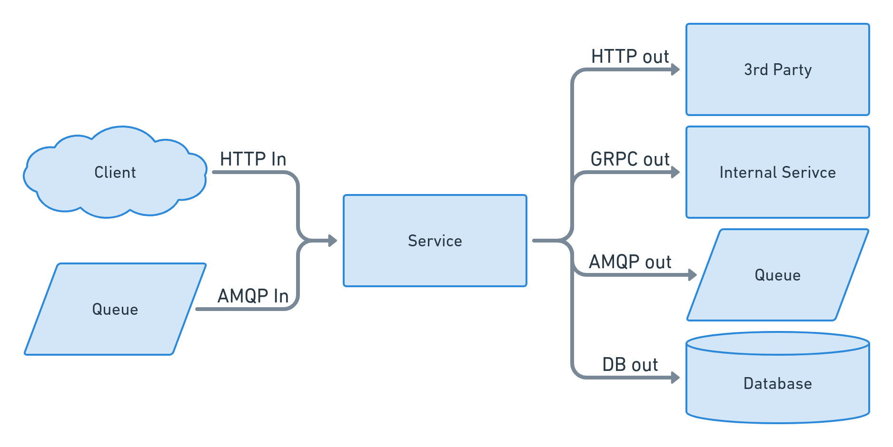

The RED method is a set of three metrics, Requests, Errors, Duration, that act as a good place to start for monitoring our microservices. When this gets first introduced into systems I frequently see it only applied in incoming HTTP traffic, but we can do better for microservices. [Tom Wilkie introduced the RED method](https://grafana.com/blog/2018/08/02/the-red-method-how-to-instrument-your-services/.) as a monitoring philosophy for any system, but we will just look at microservices for now.

Assuming our service primarily handles incoming HTTP traffic, we might start with these:

- Requests, the count of incoming HTTP requests as requests/second
- Errors, total HTTP errors as (!status_code_5xx)/total_requests
- Duration, the latency of our responses as p50, p90, or p99 percentile latency

This is good because we cover a primary source of incoming traffic for our system and general happiness indicator of our clients. However, we are missing out on the other network pipes our service is using. Your service might vary, but here are the inflows and outflows for our "example" microservice:

In addition to inbound HTTP we typically have:

- HTTP inflow, incoming requests we handle
- AMQP inflow, incoming message we consume
- HTTP outflow, the outgoing request to 3rd parties
- GRCP outflow, outgoing requests in other internal services
- AMQP outflow, outgoing messages to a queuing system
- DB outflow, outgoing requests to the database

Your service may use different protocols and have a separate set of inbound and outbound clients. For each pipe both in and out of your service, we want to apply the RED method.
