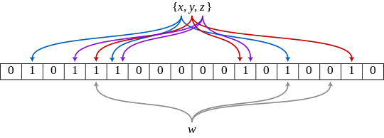

We can make significant gains in space efficiency by reducing our accuracy from exactly 100% to approximately 100%.

Most data structures I had previously worked with are 100% accurate, either an element is in a hashmap or it is not. This accuracy is something I had assumed about all data structures. Bloom filters on the other hand are a type of probabilistic data structure where the answer is 'no' or 'maybe yes', and with this uncertainty comes space efficiency.

Unlike a hashmap which uses a single hash function and dynamic buckets to store values, bloom filters use multiple hash functions and a fixed size bitmap. For each element added to our bloom filter, we hash it with each one of the hash functions and set the corresponding bit in our bitmap. To check the presence of an element in our bloom filter, we check to see all the corresponding hash function bitmap values have been set. Because the bitmap is fixed in size, there is a chance of a collision and false positive.

There is a [live demo of bloom filter bitmaps in action here][demo], and I wrote a [tiny 50 line implementation][loc] in go if you want to see the code

There is a [mathematical relationship][calc] determining how to calculate the 3 parameters for our bloom filter, we can decide 2:
1. Desired probability of a false positive
1. Bloom filter size
1. Number of elements in the filter

### Example

Let's assume we want to store 1 million elements by 36-byte string IDs (e.g. UUIDs). Our dataset will be 36MB, let's see what the bloom filter space gains look like:

| False positive rate  | Size  | Times smaller |
|----------------------|-------|---------------|
| 0.000001 (1/million) | 3.4MB | 10            |
| 0.0001 (1/10,000)    | 2.3MB | 15            |
| 0.001 (1/1000)       | 1.7MB | 21            |

Because bloom filters store a hashed bitmap value instead of the actual value, their size is proportional to the number of elements instead of the size of the stored data. So longer IDs would give a larger compression rate.

Justin Ryan from Netflix gave a talk [_Scaling Patterns for Netflix's Edge_][auth] that includes how bloom filters can be used on the edge to determine when user authentication should be refreshed against a database.

[auth]: https://www.infoq.com/presentations/netflix-edge-scalability-patterns/

[calc]: https://hur.st/bloomfilter/

[demo]: https://llimllib.github.io/bloomfilter-tutorial/

[loc]: https://github.com/KlotzAndrew/perhaps/blob/main/bloom/bloom.go
