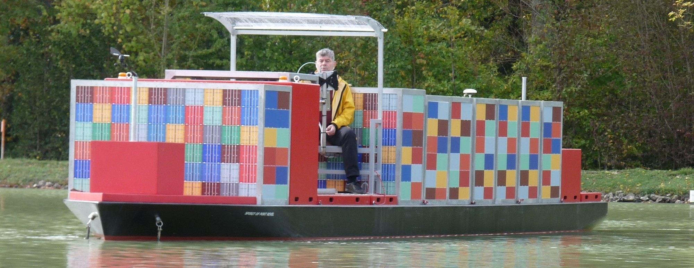
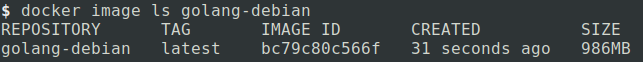
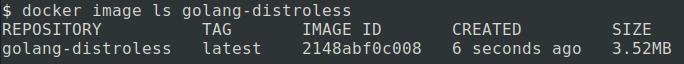
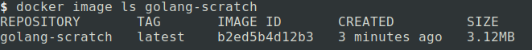

We are going to be building 3 docker images in search of the smallest Golang docker image. A while back I reduced the size of a Golang docker container to speed up deploys. The original one was 1GB, which took a ton of time to transfer over the network. Fortunately, it can be reduced to a small fraction of that. These are the 3 images we will be looking at:

- Debian bullseye
- Distroless
- Scratch

Results are at the end if you want to skip ahead. And as a funny aside, I was recently reading about [Port Revel](https://www.youtube.com/watch?v=tEDrFiQq1_k). They use tiny scaled models of container ships as pilot training, and would make a great photo for someone who was digitally shipping docker containers!



Our tiny Go app that we will be running in a docker container will only `println` to let us know it is running. We could do optimizations to reduce the size of the binary will tools like ldflags or upx, but for now we are looking at the docker image itself and keeping the binary size a constant.

```go
// main.go
package main

func main() {
	println("Hello, World!")
}

// go.mod
module scratch

go 1.17
```

### Debian

Now our Dockerfile is going to be `FROM golang:1.18-bullseye`, and we are going to want to run this as a non-root user. Taking inspiration from [this StackOverflow link](https://stackoverflow.com/a/55757473/12429735) for our `adduser` command, we setup a non-root user:

```docker
RUN adduser \
  --disabled-password \
  --gecos "" \
  --home "/nonexistent" \
  --shell "/sbin/nologin" \
  --no-create-home \
  --uid 65532 \
  small-user

USER small-user:small-user
```

And putting in some steps to compile our golang app, we have our Dockerfile:

```docker
# Dockerfile.debian
FROM golang:1.18-bullseye

RUN adduser \
  --disabled-password \
  --gecos "" \
  --home "/nonexistent" \
  --shell "/sbin/nologin" \
  --no-create-home \
  --uid 65532 \
  small-user

WORKDIR $GOPATH/src/smallest-golang/app/

COPY . .

RUN go mod download
RUN go mod verify

RUN CGO_ENABLED=0 GOOS=linux GOARCH=amd64 go build -o /main .

USER small-user:small-user

CMD ["/main"]
```

 Running it gets us a 968MB image

```bash
docker build -t golang-debian -f Dockerfile.debian .
docker run --rm golang-debian:latest
# Hello, World!
```



### Distroless

For our next image, we will use [distroless](https://github.com/GoogleContainerTools/distroless) from Google’s [GoogleContainerTools](https://github.com/GoogleContainerTools) GitHub organization. These images are designed to be just what is needed for the runtime. To use this we will use a multi-stage docker build by adding a name to our first `FROM` with `FROM golang:1.18-bullseye as base`, and a second `FROM` to build off the first:

```docker
FROM gcr.io/distroless/static-debian11

COPY --from=base /main .

USER small-user:small-user

CMD ["./main"]
```

This is what the whole Dockerfile looks like, we use `--from=base` to copy files generated in the first docker image.

```docker
# Dockerfile.distroless
FROM golang:1.18-bullseye as base

RUN adduser \
  --disabled-password \
  --gecos "" \
  --home "/nonexistent" \
  --shell "/sbin/nologin" \
  --no-create-home \
  --uid 65532 \
  small-user

WORKDIR $GOPATH/src/smallest-golang/app/

COPY . .

RUN go mod download
RUN go mod verify

RUN CGO_ENABLED=0 GOOS=linux GOARCH=amd64 go build -o /main .

FROM gcr.io/distroless/static-debian11

COPY --from=base /main .

USER small-user:small-user

CMD ["./main"]
```

This cuts the size down all the way to 3.52MB!

```docker
docker build -t golang-distroless -f Dockerfile.distroless .
docker run --rm golang-distroless
# Hello, World!
```



### Scratch

We can try to get this image even smaller by using scratch directly. This image will need a few things to support non-root users, SSL, and timezones. We need to copy them from the base image with

```docker
COPY --from=base /usr/share/zoneinfo /usr/share/zoneinfo
COPY --from=base /etc/ssl/certs/ca-certificates.crt /etc/ssl/certs/
COPY --from=base /etc/passwd /etc/passwd
COPY --from=base /etc/group /etc/group
```

Aside from those lines, the Dockerfile looks identical to the distroless one Dockerfile:

```docker
FROM golang:1.18-bullseye as base

RUN adduser \
  --disabled-password \
  --gecos "" \
  --home "/nonexistent" \
  --shell "/sbin/nologin" \
  --no-create-home \
  --uid 65532 \
  small-user

WORKDIR $GOPATH/src/smallest-golang/app/

COPY . .

RUN go mod download
RUN go mod verify

RUN CGO_ENABLED=0 GOOS=linux GOARCH=amd64 go build -o /main .

FROM scratch

COPY --from=base /usr/share/zoneinfo /usr/share/zoneinfo
COPY --from=base /etc/ssl/certs/ca-certificates.crt /etc/ssl/certs/
COPY --from=base /etc/passwd /etc/passwd
COPY --from=base /etc/group /etc/group

COPY --from=base /main .

USER small-user:small-user

CMD ["./main"]
```

This reduces the size down to 3.12 MB

```cpp
docker build -t golang-scratch -f Dockerfile.scratch .
docker run --rm golang-scratch:latest
# Hello, World!
```




### Results

- Debian bullseye: 986MB
- Distroless: 3.52MB
- Scratch: 3.12MB
