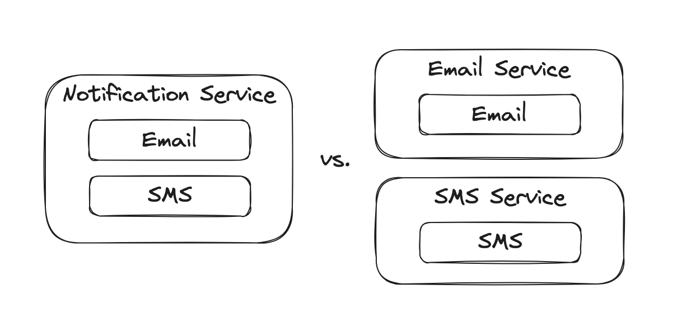

How do you go about deciding how big services should be when using service oriented design or micro-services?  [Software Architecture the Hard Parts](https://www.goodreads.com/en/book/show/58153482) uses the term “Granularity Disintegrators” and “Granularity Integrators” to capture two ideas related to this. Firstly, ‘granularity’ is the idea that instead of a black and white “new service or no new service” the size is a scale of smaller to larger that we can decide on. Integrators and Disintegrators are the forces that either pull those components together into larger pieces, or break them down into smaller pieces.

Knowing the tradeoff between the forces pulling towards smaller services or larger services helps make better informed decisions on what should be a service. Or answer a question retroactively, should this be one or many services?

There are 6 Granularity Disintegrators:  Code volatility, Scalability and throughput, Fault tolerance, Security, Extensibility, Service scope and function.

### **Code volatility**

Deployments are inherently risky and have a blast radius. Deploying code changes is most frequently when issues are introduced. While we want to do it often and quickly, to deliver value to end users, it adds risk that we do not like in a blast radius. The blast radius is proportional to the amount of code deployed. The smaller the units of code deployed, the smaller the blast radius. The smaller the blast radius, the easier to verify the changes.

A difference in code volatility can push services apart into smaller pieces for two reasons:

1. Smaller units in are easier to test and verify, and typically build and deploy
2. Separating more volatile code from less volatile code means we can leave more of the less volatile code to be deployed less frequently, resulting in less risk

Here our email component changes 12 times per day while our SMS component changes once per month. This difference would be a force to pull them apart into different services.

### **Scalability and throughput**

Not all components of a system scale at the same rate. Differences in scaling needs can open up opportunities to optimize by splitting high scale components out from lower scale components. 

Here our email component handles 12k requests per minute, while our SMS component handles 1 request per minute. This difference would be a force to pull them apart into different services. 

A note worth mentioning here is that cloud providers like AWS can scale surprisingly far vertically, so large differences in throughput might not have a material impact on resource availability for scaling.

### **Fault tolerance**

Different components may have different uptime requirements, or guard themselves from cascading failures of another system component. Seperating services from each other, compared to living in a monolith together can shield them from failure in the other service.

What is interesting is fault tolerance does not come for free, and by default going from one service to two services may reduce overall reliability. 

Here out monolith has two components with different uptime requirements. Separating them could ensure that the payments component does not go down due to an issue with notifications.

### **Security**

Security standards may require certain pieces of data to be treated differently from other pieces of data. An example of this is the PCI standards (payment card industry), where data around credit cards needs much more extensive security controls than those of other pieces of data.

Here our monolith has a payments component and notifications component, where the payments component must follow PCI security standards. This would be a force pulling payments into its own service, so instead of the entire monolith being required to follow PCI standards, only the payments service needs to.

### **Extensibility**

Designing services around handling upcoming functionality can help us down the line. Ideally, we want newly added functionality to either fit nicely into a single service or live entirely in a new service. 

In our example notifications service, email and SMS are split apart. Upcoming functionality will only require changes to the email service, making a force to pull that apart to isolate changes.

The opposite effect would be functionality that requires change across multiple service, making it harder to introduce functionality compared to a monolith.

### **Service scope and function**

The more unrelated things a service is doing the more likely it should be broken up into smaller pieces. While this one should be mentioned, I think it frequently comes up as red herring if it is the primary driver. In the context of lines of code, this criteria provides no value. If a small contained module within a service is changing, what does it matter how many things the rest of the service is doing?

In my experience the decision is usually framed as the example below. The notifications service is big and hairy, with lots of unrelated functionality - should we split it up into its own service? When presented as the clean option below, it leads us towards a decision to make more services.

The prior diagram conflates two issues: tangled code, and services. What we actually might want to choose between is tangled code and untangled code. In my experience, trying to untangle code by splitting it into services can frequently end up with tangled code in two different services, plus all the pains and toil of a distributed system.

